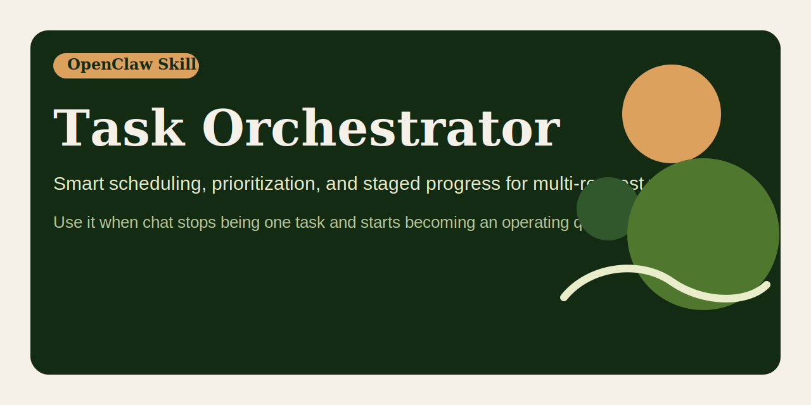

# Task Orchestrator




An OpenClaw skill for handling multiple user requests with sane scheduling, staged progress updates, and restart-aware continuity.

## Quick pitch

Smart scheduling, prioritization, and staged progress for multi-request work.
Use it when chat stops being one task and starts becoming an operating queue.

## Why this exists

Users do not send work in neat little tickets. They send one task, then another, then a third thing that quietly changes the priority of the first two. If an agent handles that stream as a dumb first-in-first-out queue, the result is predictable: long tasks block short ones, blockers wait too long, progress disappears into silence, and restarts scatter the active plan.

`task-orchestrator` exists to stop that nonsense.

It gives an agent a default operating policy for multi-request chat work:

- split incoming messages into discrete tasks
- identify dependencies, conflicts, urgency, and external wait costs
- launch valuable long-running work early
- use wait windows for quick wins
- report partial results as soon as they are useful
- cooperate with continuity files when the work needs to survive longer than one clean turn

This is not a project manager cosplay prompt. It is a compact execution policy for agents that need to behave like competent operators.

## Works independently

`task-orchestrator` is intentionally useful on its own.

Use it even if you do not adopt any companion skill yet. On its own, it already improves:

- task triage
- ordering and prioritization
- safe parallel execution
- progress reporting
- conflict handling

Companion skills make persistence and restart recovery stronger, but they are optional enhancements, not hidden prerequisites.

## Family role

Within this repo family, `task-orchestrator` is the scheduling brain.

Use it when the main problem is ordering, prioritization, and safe parallel execution.
Do not expect it to become the full continuity bundle; that is exactly how focused repos rot.

## What the skill teaches

The skill tells the agent to:

- avoid strict arrival-order handling unless the user explicitly asks for it
- prioritize unblockers, urgency, impact, and runtime economics
- keep the main thread focused on orchestration and user communication
- offload slower execution to subthreads or subagents when useful
- stop and ask only at real decision points, not out of learned helplessness
- keep continuity state aligned when the work spans turns or restarts

## When to use it

Use `task-orchestrator` when:

- a user sends several tasks across separate messages
- some tasks are quick while others are long-running
- work can be parallelized safely
- tasks may conflict or block one another
- the agent should provide staged progress updates
- the task bundle may survive session resets or gateway restarts

## Example behavior

### Example 1: mixed workload

User sends:

- "Fix the config bug"
- "Also summarize this log"
- "And start a PR review"

A good agent should:

1. inspect whether the config bug is a blocker
2. launch the PR review as background work if appropriate
3. summarize the log while waiting on the longer lane
4. report the config result immediately instead of sitting on it

### Example 2: conflicting work

User sends:

- "Refactor this module"
- "Do not change the public API yet"
- "Also rename the exported functions"

A good agent should stop at the conflict and ask which instruction wins, instead of confidently making a mess.

### Example 3: restart-aware multitasking

User sends several active tasks, then the gateway needs a restart.

A good agent should:

1. keep the per-chat unfinished queue in `TODO.md`
2. keep the current top task in `memory/active-task.md`
3. schedule the fallback restart nudge if the restart is intentional
4. resume the top task first after restart
5. tell the user what resumed without being asked

## Related skills

These are related, not required:

- `task-state-sync`: keeps continuity files accurate during live multitask work — <https://github.com/ruanrrn/task-state-sync>
- `multi-task-continuity`: umbrella workflow that combines orchestration, state sync, and restart-safe recovery — <https://github.com/ruanrrn/multi-task-continuity>

If you only need the scheduling brain, use this repo alone.

## Social preview

Suggested social preview asset: `assets/social-preview.svg`

Suggested one-line copy:

> Smart scheduling, prioritization, and staged progress for multi-request work.

GitHub note:

- The current `gh` CLI and GraphQL `UpdateRepositoryInput` do not expose a writable custom social preview field.
- To use this image as the repository social preview, upload `assets/social-preview.svg` manually in the repo settings UI.

## What you get

- `task-orchestrator/` - the skill source
- `dist/task-orchestrator.skill` - packaged artifact ready to import

## Install

Use either path:

1. Import `dist/task-orchestrator.skill` into an OpenClaw environment.
2. Copy `task-orchestrator/` into your skills directory if you want the editable source.

## Repository layout

```text
task-orchestrator/
├── LICENSE
├── README.md
├── assets/
│   └── social-preview.svg
├── task-orchestrator/
│   └── SKILL.md
└── dist/
    └── task-orchestrator.skill
```

## Contributing

See `CONTRIBUTING.md` for contribution scope, PR expectations, and how to keep this repo focused on orchestration instead of turning it into a junk drawer.

## Release hygiene

- Regenerate `dist/task-orchestrator.skill` after each material skill change
- Keep the repository focused on this skill only
- Keep the repository description aligned with the trigger language in `SKILL.md`
- Update examples when the orchestration policy changes in meaningful ways

## Repository

- GitHub: `https://github.com/ruanrrn/task-orchestrator`
- License: MIT
